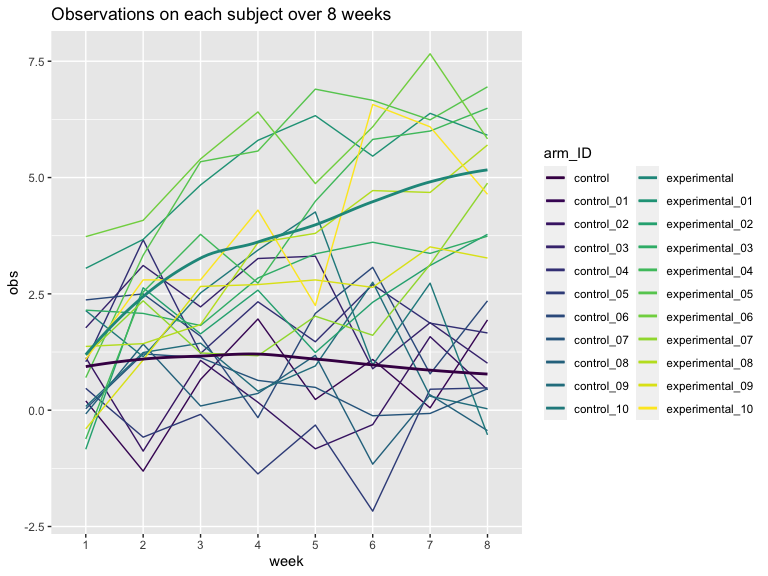

p8105_hw5_rl3411
================
rl3411
2023-11-09

``` r
library(tidyverse)
```

    ## ── Attaching core tidyverse packages ──────────────────────── tidyverse 2.0.0 ──
    ## ✔ dplyr     1.1.3          ✔ readr     2.1.4     
    ## ✔ forcats   1.0.0          ✔ stringr   1.5.0     
    ## ✔ ggplot2   3.4.3          ✔ tibble    3.2.1.9006
    ## ✔ lubridate 1.9.2          ✔ tidyr     1.3.0     
    ## ✔ purrr     1.0.2          
    ## ── Conflicts ────────────────────────────────────────── tidyverse_conflicts() ──
    ## ✖ dplyr::filter() masks stats::filter()
    ## ✖ dplyr::lag()    masks stats::lag()
    ## ℹ Use the conflicted package (<http://conflicted.r-lib.org/>) to force all conflicts to become errors

``` r
library(purrr)

knitr::opts_chunk$set(
    echo = TRUE,
    warning = FALSE,
    fig.width = 8, 
  fig.height = 6,
  out.width = "100%"
)

options(
  ggplot2.continuous.colour = "viridis",
  ggplot2.continuous.fill = "viridis"
)

scale_colour_discrete = scale_colour_viridis_d
scale_fill_discrete = scale_fill_viridis_d
```

# Problem 1

``` r
hom_data = read_csv("data/homicide-data.csv")
```

    ## Rows: 52179 Columns: 12
    ## ── Column specification ────────────────────────────────────────────────────────
    ## Delimiter: ","
    ## chr (9): uid, victim_last, victim_first, victim_race, victim_age, victim_sex...
    ## dbl (3): reported_date, lat, lon
    ## 
    ## ℹ Use `spec()` to retrieve the full column specification for this data.
    ## ℹ Specify the column types or set `show_col_types = FALSE` to quiet this message.

Describe raw data!

``` r
hom_data = hom_data |> 
  mutate(city_state = paste(city, state, sep =", "))
```

# Problem 2

### Create and tidy dataset

``` r
study = 
  tibble(file_name = list.files(path = "data", 
                                pattern = "^[a-z]{3}_\\d{2}\\.csv$", 
                                full.names = TRUE)) |> 
  mutate(value = map(file_name, read_csv)) |> 
  unnest(value) |> 
  pivot_longer(
    week_1:week_8,
    names_to = "week",
    values_to = "obs"
  ) |> 
  mutate(week = str_sub(week, 6, 6),
         file_name = str_sub(file_name, 6, 11),
         file_name = str_replace_all(file_name, c("con"= "control", "exp" = "experimental"))) |> 
  rename(arm_ID = file_name)
```

### Spaghetti plot: observations on each subject over time

``` r
study |> 
  mutate(arm = case_when(
    str_detect(arm_ID, "^control") ~ "control",
    str_detect(arm_ID, "^experimental") ~ "experimental")) |> 
  ggplot(aes(x = week, y = obs, group = arm_ID, color = arm_ID)) + 
  geom_line() +
  geom_smooth(aes(group = arm, color = factor(arm)), se = F) +
  labs(title = "Observations on each subject over 8 weeks")
```



From this plot, we can see that the observational values for subjects in
the experimental arm increases through the 8-week period while those in
the control arm remain around 1.2 units. This suggests that the
treatment/intervention might be causing an effect, resulting in higher
values among the experimental group.
