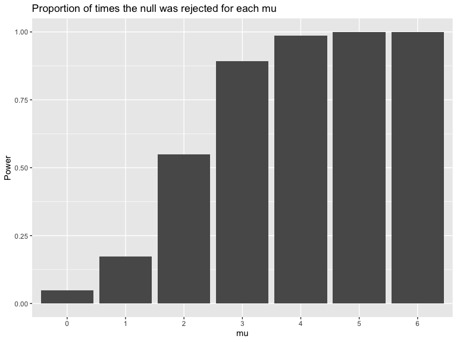

p8105_hw5_rl3411
================
rl3411
2023-11-09

``` r
library(tidyverse)
```

    ## ── Attaching core tidyverse packages ──────────────────────── tidyverse 2.0.0 ──
    ## ✔ dplyr     1.1.3          ✔ readr     2.1.4     
    ## ✔ forcats   1.0.0          ✔ stringr   1.5.0     
    ## ✔ ggplot2   3.4.3          ✔ tibble    3.2.1.9006
    ## ✔ lubridate 1.9.2          ✔ tidyr     1.3.0     
    ## ✔ purrr     1.0.2          
    ## ── Conflicts ────────────────────────────────────────── tidyverse_conflicts() ──
    ## ✖ dplyr::filter() masks stats::filter()
    ## ✖ dplyr::lag()    masks stats::lag()
    ## ℹ Use the conflicted package (<http://conflicted.r-lib.org/>) to force all conflicts to become errors

``` r
library(purrr)

knitr::opts_chunk$set(
    echo = TRUE,
    warning = FALSE,
    fig.width = 8, 
  fig.height = 6,
  out.width = "100%"
)

options(
  ggplot2.continuous.colour = "viridis",
  ggplot2.continuous.fill = "viridis"
)

scale_colour_discrete = scale_colour_viridis_d
scale_fill_discrete = scale_fill_viridis_d
```

# Problem 1

``` r
hom_data = read_csv("data/homicide-data.csv") |> 
  mutate(city_state = paste(city, state, sep =", ")) 
```

    ## Rows: 52179 Columns: 12
    ## ── Column specification ────────────────────────────────────────────────────────
    ## Delimiter: ","
    ## chr (9): uid, victim_last, victim_first, victim_race, victim_age, victim_sex...
    ## dbl (3): reported_date, lat, lon
    ## 
    ## ℹ Use `spec()` to retrieve the full column specification for this data.
    ## ℹ Specify the column types or set `show_col_types = FALSE` to quiet this message.

This dataset contains 52,179 criminal homicides from 2007 to 2017 in 50
American cities. It includes the date, location of the killing
(latitude, longitude, city and state of the killing), demographic
information about each victim (first and last name, race, age, sex) and
the disposition of each record.

``` r
disp_df = hom_data |> 
  group_by(city_state) |> 
  summarize(total_homicides = n(),
            unsolved = sum(disposition == "Closed without arrest" | disposition == "Open/No arrest"))
```

``` r
balt_prop = disp_df |> 
  filter(city_state == "Baltimore, MD") 

test = 
  prop.test(x = balt_prop$unsolved, n = balt_prop$total_homicides) |> 
  broom::tidy() |> 
  select(estimate, conf.low, conf.high)
test
```

    ## # A tibble: 1 × 3
    ##   estimate conf.low conf.high
    ##      <dbl>    <dbl>     <dbl>
    ## 1    0.646    0.628     0.663

``` r
result = disp_df |> 
  mutate(test_result = map2(unsolved, total_homicides, prop.test)) |> 
  mutate(test_result = map(test_result, broom::tidy)) |> 
  unnest(test_result) |> 
  select(city_state, estimate, conf.low, conf.high) 

knitr::kable(result)
```

| city_state         |  estimate |  conf.low | conf.high |
|:-------------------|----------:|----------:|----------:|
| Albuquerque, NM    | 0.3862434 | 0.3372604 | 0.4375766 |
| Atlanta, GA        | 0.3833505 | 0.3528119 | 0.4148219 |
| Baltimore, MD      | 0.6455607 | 0.6275625 | 0.6631599 |
| Baton Rouge, LA    | 0.4622642 | 0.4141987 | 0.5110240 |
| Birmingham, AL     | 0.4337500 | 0.3991889 | 0.4689557 |
| Boston, MA         | 0.5048860 | 0.4646219 | 0.5450881 |
| Buffalo, NY        | 0.6122841 | 0.5687990 | 0.6540879 |
| Charlotte, NC      | 0.2998544 | 0.2660820 | 0.3358999 |
| Chicago, IL        | 0.7358627 | 0.7239959 | 0.7473998 |
| Cincinnati, OH     | 0.4452450 | 0.4079606 | 0.4831439 |
| Columbus, OH       | 0.5304428 | 0.5002167 | 0.5604506 |
| Dallas, TX         | 0.4811742 | 0.4561942 | 0.5062475 |
| Denver, CO         | 0.5416667 | 0.4846098 | 0.5976807 |
| Detroit, MI        | 0.5883287 | 0.5687903 | 0.6075953 |
| Durham, NC         | 0.3659420 | 0.3095874 | 0.4260936 |
| Fort Worth, TX     | 0.4644809 | 0.4222542 | 0.5072119 |
| Fresno, CA         | 0.3470226 | 0.3051013 | 0.3913963 |
| Houston, TX        | 0.5074779 | 0.4892447 | 0.5256914 |
| Indianapolis, IN   | 0.4493192 | 0.4223156 | 0.4766207 |
| Jacksonville, FL   | 0.5111301 | 0.4820460 | 0.5401402 |
| Kansas City, MO    | 0.4084034 | 0.3803996 | 0.4370054 |
| Las Vegas, NV      | 0.4141926 | 0.3881284 | 0.4407395 |
| Long Beach, CA     | 0.4126984 | 0.3629026 | 0.4642973 |
| Los Angeles, CA    | 0.4900310 | 0.4692208 | 0.5108754 |
| Louisville, KY     | 0.4531250 | 0.4120609 | 0.4948235 |
| Memphis, TN        | 0.3190225 | 0.2957047 | 0.3432691 |
| Miami, FL          | 0.6048387 | 0.5685783 | 0.6400015 |
| Milwaukee, wI      | 0.3614350 | 0.3333172 | 0.3905194 |
| Minneapolis, MN    | 0.5109290 | 0.4585150 | 0.5631099 |
| Nashville, TN      | 0.3624511 | 0.3285592 | 0.3977401 |
| New Orleans, LA    | 0.6485356 | 0.6231048 | 0.6731615 |
| New York, NY       | 0.3875598 | 0.3494421 | 0.4270755 |
| Oakland, CA        | 0.5364308 | 0.5040588 | 0.5685037 |
| Oklahoma City, OK  | 0.4851190 | 0.4467861 | 0.5236245 |
| Omaha, NE          | 0.4132029 | 0.3653146 | 0.4627477 |
| Philadelphia, PA   | 0.4478103 | 0.4300380 | 0.4657157 |
| Phoenix, AZ        | 0.5514223 | 0.5184825 | 0.5839244 |
| Pittsburgh, PA     | 0.5340729 | 0.4942706 | 0.5734545 |
| Richmond, VA       | 0.2634033 | 0.2228571 | 0.3082658 |
| Sacramento, CA     | 0.3696809 | 0.3211559 | 0.4209131 |
| San Antonio, TX    | 0.4285714 | 0.3947772 | 0.4630331 |
| San Bernardino, CA | 0.6181818 | 0.5576628 | 0.6753422 |
| San Diego, CA      | 0.3796095 | 0.3354259 | 0.4258315 |
| San Francisco, CA  | 0.5067873 | 0.4680516 | 0.5454433 |
| Savannah, GA       | 0.4674797 | 0.4041252 | 0.5318665 |
| St. Louis, MO      | 0.5396541 | 0.5154369 | 0.5636879 |
| Stockton, CA       | 0.5990991 | 0.5517145 | 0.6447418 |
| Tampa, FL          | 0.4567308 | 0.3881009 | 0.5269851 |
| Tulsa, AL          | 0.0000000 | 0.0000000 | 0.9453792 |
| Tulsa, OK          | 0.3310463 | 0.2932349 | 0.3711192 |
| Washington, DC     | 0.4379182 | 0.4112495 | 0.4649455 |

``` r
result |>  
  mutate(city_state = fct_reorder(city_state, estimate)) |> 
  ggplot(aes(x = estimate, y = city_state)) +
  geom_point() +
  geom_errorbar(aes(xmin = conf.low, xmax = conf.high)) + 
  labs (title = "Proportion of unsolved homicides in each city",
        x = "Proportion",
        y = "City")
```


# Problem 2

### Create and tidy dataset

``` r
study = 
  tibble(file_name = list.files(path = "data", 
                                pattern = "^[a-z]{3}_\\d{2}\\.csv$", 
                                full.names = TRUE)) |> 
  mutate(value = map(file_name, read_csv)) |> 
  unnest(value) |> 
  pivot_longer(
    week_1:week_8,
    names_to = "week",
    values_to = "obs"
  ) |> 
  mutate(week = str_sub(week, 6, 6),
         file_name = str_sub(file_name, 6, 11),
         file_name = str_replace_all(file_name, c("con"= "control", "exp" = "experimental"))) |> 
  rename(arm_ID = file_name)
```

### Spaghetti plot: observations on each subject over time

``` r
study |> 
  mutate(arm = case_when(
    str_detect(arm_ID, "^control") ~ "control",
    str_detect(arm_ID, "^experimental") ~ "experimental")) |> 
  ggplot(aes(x = week, y = obs, group = arm_ID, color = arm_ID)) + 
  geom_line() +
  geom_smooth(aes(group = arm, color = factor(arm)), se = F) +
  labs(title = "Observations on each subject over 8 weeks")
```


From this plot, we can see that the observational values for subjects in
the experimental arm increases through the 8-week period while those in
the control arm remain around 1.2 units. This suggests that the
treatment/intervention might be causing an effect, resulting in higher
values among the experimental group.

# Problem 3

h \### Generating dataset of samples

``` r
set.seed(828)

mu_sample = function(mu, n = 30, sd = 5){
  x_vec = rnorm(n = n, mean = mu, sd = sd)
  sim_result = t.test(x_vec, mu = 0, alternative = "two.sided", conf.level = 0.95) |> 
    broom::tidy() |> 
    select(estimate, p.value)
}

sim_result_df = 
  expand_grid(
    mu = c(0,1,2,3,4,5,6),
    iter = 1:5000
  ) |> 
  mutate(estimate_df = map(mu, mu_sample)) |> 
  unnest(estimate_df) |> 
  mutate(power = p.value < 0.05)
```

### Investigating the power of the test

``` r
sim_result_df |>  
  group_by(mu) |>  
  summarize(prop = mean(power)) |> 
  ggplot(aes(x = factor(mu), y = prop)) +
  geom_bar(stat = "identity") +
  labs(title = "Proportion of times the null was rejected for each mu",
       x = "mu",
       y = "Power")
```



From this plot, we can see that the power increases as the true value of
$\mu$ increases, i.e. power increases as effect size increases.

### How does the average estimate of $\hat{\mu}$ for all data differ from those that rejected the null?

``` r
avg_estimate = sim_result_df |>  
  group_by(mu) |>  
  summarize(mean_muhat = mean(estimate)) |> 
  mutate(data = "all")

overlay_data = sim_result_df |> 
  filter(power == TRUE) |> 
  select(mu, estimate) |> 
  group_by(mu) |>  
  summarize(mean_muhat = mean(estimate)) |> 
  mutate(data = "null rejected")

graph_df = bind_rows(avg_estimate, overlay_data)

graph_df |> 
  ggplot(aes(x = mu, y = mean_muhat, color = data)) +
  geom_line() +
  geom_point() +
  geom_text(aes(label=round(mean_muhat,1)), 
            vjust = -2,  
            size=3) +
  scale_x_discrete(limits = seq(0,6,1)) +
  scale_y_discrete(limits = seq(0,6,1)) +
  labs(title = "All data vs rejected null",
       x = "true mu",
       y = "Average estimate of mu hat")
```


Here, we can see that the average estimate of $\hat{\mu}$ for the
rejected null data **deviates** from all data, for smaller values of the
true $\mu$. But as the true $\mu$ increases, the difference gets smaller
and the sample average of $\hat{\mu}$ starts to be approximately equal
to the true value of $\mu$ starting $\mu=4$. The reason behind this is
because for smaller $\mu$, there would be more estimates closer to 0,
meaning that only the estimates that are further away from 0 will have
the null hypothesis rejected. As the true value for $\mu$ increases, we
would expect all or almost all samples to have $\hat{\mu}$ significantly
different from 0.
