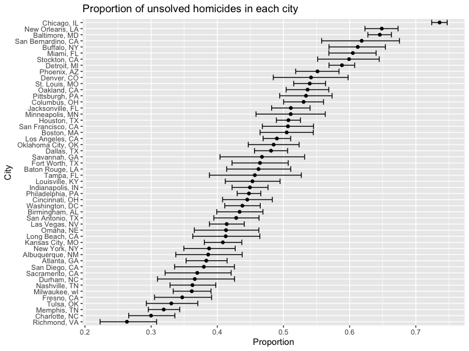

p8105_hw5_rl3411
================
rl3411
2023-11-09

``` r
library(tidyverse)
```

    ## ── Attaching core tidyverse packages ──────────────────────── tidyverse 2.0.0 ──
    ## ✔ dplyr     1.1.3          ✔ readr     2.1.4     
    ## ✔ forcats   1.0.0          ✔ stringr   1.5.0     
    ## ✔ ggplot2   3.4.3          ✔ tibble    3.2.1.9006
    ## ✔ lubridate 1.9.2          ✔ tidyr     1.3.0     
    ## ✔ purrr     1.0.2          
    ## ── Conflicts ────────────────────────────────────────── tidyverse_conflicts() ──
    ## ✖ dplyr::filter() masks stats::filter()
    ## ✖ dplyr::lag()    masks stats::lag()
    ## ℹ Use the conflicted package (<http://conflicted.r-lib.org/>) to force all conflicts to become errors

``` r
library(purrr)

knitr::opts_chunk$set(
    echo = TRUE,
    warning = FALSE,
    fig.width = 8, 
  fig.height = 6,
  out.width = "100%"
)

options(
  ggplot2.continuous.colour = "viridis",
  ggplot2.continuous.fill = "viridis"
)

scale_colour_discrete = scale_colour_viridis_d
scale_fill_discrete = scale_fill_viridis_d
```

# Problem 1

``` r
hom_data = read_csv("data/homicide-data.csv") |> 
  mutate(city_state = paste(city, state, sep =", ")) 
```

    ## Rows: 52179 Columns: 12
    ## ── Column specification ────────────────────────────────────────────────────────
    ## Delimiter: ","
    ## chr (9): uid, victim_last, victim_first, victim_race, victim_age, victim_sex...
    ## dbl (3): reported_date, lat, lon
    ## 
    ## ℹ Use `spec()` to retrieve the full column specification for this data.
    ## ℹ Specify the column types or set `show_col_types = FALSE` to quiet this message.

Describe raw data!

``` r
disp_df = hom_data |> 
  group_by(city_state) |> 
  summarize(total_homicides = n(),
            unsolved = sum(disposition == "Closed without arrest" | disposition == "Open/No arrest"))
```

``` r
balt_prop = disp_df |> 
  filter(city_state == "Baltimore, MD") 

test = 
  prop.test(x = balt_prop$unsolved, n = sum(balt_prop$unsolved, balt_prop$total_homicides)) |> 
  broom::tidy() |> 
  select(estimate, conf.low, conf.high)
```

For the city of Baltimore, MD, use the prop.test function to estimate
the proportion of homicides that are unsolved; save the output of
prop.test as an R object, apply the broom::tidy to this object and pull
the estimated proportion and confidence intervals from the resulting
tidy dataframe.

# Problem 2

### Create and tidy dataset

``` r
study = 
  tibble(file_name = list.files(path = "data", 
                                pattern = "^[a-z]{3}_\\d{2}\\.csv$", 
                                full.names = TRUE)) |> 
  mutate(value = map(file_name, read_csv)) |> 
  unnest(value) |> 
  pivot_longer(
    week_1:week_8,
    names_to = "week",
    values_to = "obs"
  ) |> 
  mutate(week = str_sub(week, 6, 6),
         file_name = str_sub(file_name, 6, 11),
         file_name = str_replace_all(file_name, c("con"= "control", "exp" = "experimental"))) |> 
  rename(arm_ID = file_name)
```

### Spaghetti plot: observations on each subject over time

``` r
study |> 
  mutate(arm = case_when(
    str_detect(arm_ID, "^control") ~ "control",
    str_detect(arm_ID, "^experimental") ~ "experimental")) |> 
  ggplot(aes(x = week, y = obs, group = arm_ID, color = arm_ID)) + 
  geom_line() +
  geom_smooth(aes(group = arm, color = factor(arm)), se = F) +
  labs(title = "Observations on each subject over 8 weeks")
```



From this plot, we can see that the observational values for subjects in
the experimental arm increases through the 8-week period while those in
the control arm remain around 1.2 units. This suggests that the
treatment/intervention might be causing an effect, resulting in higher
values among the experimental group.

# Problem 3

h \### Generating dataset of samples

``` r
set.seed(828)

mu_sample = function(mu, n = 30, sd = 5){
  x_vec = rnorm(n = n, mean = mu, sd = sd)
  sim_result = t.test(x_vec, mu = 0, alternative = "two.sided", conf.level = 0.95) |> 
    broom::tidy() |> 
    select(estimate, p.value)
}

sim_result_df = 
  expand_grid(
    mu = c(0,1,2,3,4,5,6),
    iter = 1:5000
  ) |> 
  mutate(estimate_df = map(mu, mu_sample)) |> 
  unnest(estimate_df) |> 
  mutate(power = p.value < 0.05)
```

### Investigating the power of the test

``` r
sim_result_df |>  
  group_by(mu) |>  
  summarize(prop = mean(power)) |> 
  ggplot(aes(x = factor(mu), y = prop)) +
  geom_bar(stat = "identity") +
  labs(title = "Proportion of times the null was rejected for each mu",
       x = "mu",
       y = "Power")
```


From this plot, we can see that the power increases as the true value of
$\mu$ increases, i.e. power increases as effect size increases.

### How does the average estimate of $\hat{\mu}$ for all data differ from those that rejected the null?

``` r
avg_estimate = sim_result_df |>  
  group_by(mu) |>  
  summarize(mean_muhat = mean(estimate)) |> 
  mutate(data = "all")

overlay_data = sim_result_df |> 
  filter(power == TRUE) |> 
  select(mu, estimate) |> 
  group_by(mu) |>  
  summarize(mean_muhat = mean(estimate)) |> 
  mutate(data = "null rejected")

graph_df = bind_rows(avg_estimate, overlay_data)

graph_df |> 
  ggplot(aes(x = mu, y = mean_muhat, color = data)) +
  geom_line() +
  geom_point() +
  geom_text(aes(label=round(mean_muhat,1)), 
            vjust = -2,  
            size=3) +
  scale_x_discrete(limits = seq(0,6,1)) +
  scale_y_discrete(limits = seq(0,6,1)) +
  labs(title = "All data vs rejected null",
       x = "true mu",
       y = "Average estimate of mu hat")
```


Here, we can see that the average estimate of $\hat{\mu}$ for the
rejected null data **deviates** from all data, for smaller values of the
true $\mu$. But as the true $\mu$ increases, the difference gets smaller
and the sample average of $\hat{\mu}$ starts to be approximately equal
to the true value of $\mu$ starting $\mu=4$. The reason behind this is
because for smaller $\mu$, there would be more estimates closer to 0,
meaning that only the estimates that are further away from 0 will have
the null hypothesis rejected. As the true value for $\mu$ increases, we
would expect all or almost all samples to have $\hat{\mu}$ significantly
different from 0.
